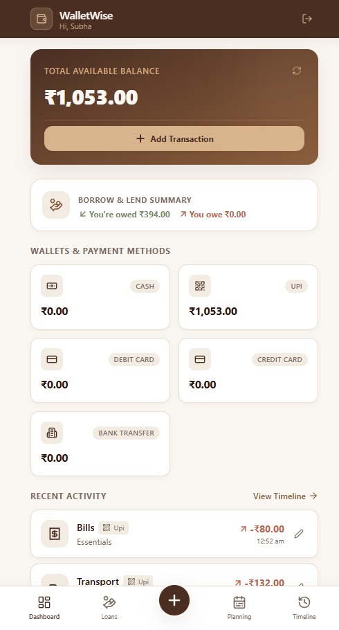
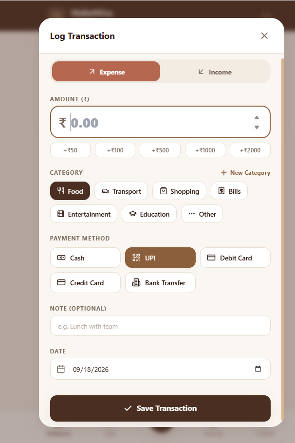
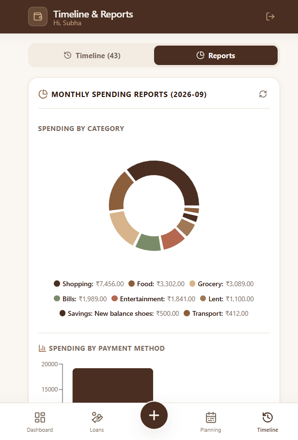
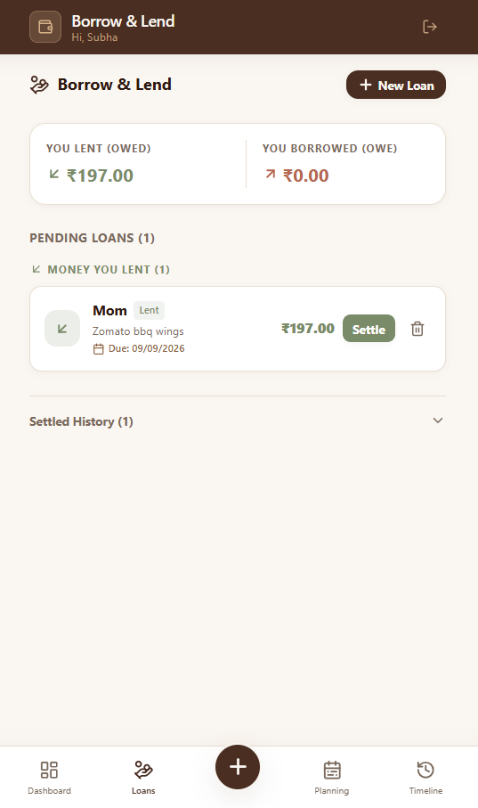
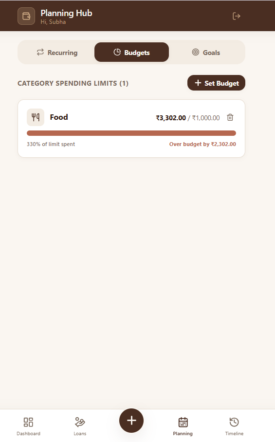

<p align="center">
  
</p>

<p align="center">
  
  
  
  
  
</p>

<p align="center">
  <sub>
  <a href="https://wallet-wise-tawny.vercel.app/"><b>LIVE DEMO</b></a>
  &nbsp;&nbsp;·&nbsp;&nbsp;
  <a href="#features">FEATURES</a>
  &nbsp;&nbsp;·&nbsp;&nbsp;
  <a href="#architecture">ARCHITECTURE</a>
  &nbsp;&nbsp;·&nbsp;&nbsp;
  <a href="#rest-api">API</a>
  &nbsp;&nbsp;·&nbsp;&nbsp;
  <a href="#local-development">SETUP</a>
  </sub>
</p>

<br>

<p align="center">
  
  
  
</p>

<br>

## Overview

WalletWise is a full-stack, mobile-first Progressive Web App for everyday personal finance.

> Managing your money should be quick, clear, and practical — not a spreadsheet chore.

Rather than treating finance tracking as formal accounting, WalletWise brings the real-world ways people actually move money — cash, UPI, cards, borrowing, lending, recurring bills — into a single lightweight interface.

Built with **React + Vite** on the frontend, **Express.js** for the REST API, and **Supabase (PostgreSQL + Auth)** for data and authentication.

| Capability | Capability | Capability |
|---|---|---|
| Income & expense tracking | Borrow & Lend manager | Savings goals |
| Five payment methods | Recurring transactions | Monthly category budgets |
| Search & filtering | Spending analytics | Installable PWA |

<br>

## Features

<table>
<tr><td width="30%"><b>Fast Transaction Logging</b></td><td>Amount presets, categories (including custom), payment methods, notes, and dates — built so everyday entry takes seconds, not minutes.</td></tr>
<tr><td><b>Multi-Wallet Tracking</b></td><td>Independent balances across Cash, UPI, Debit Card, Credit Card, and Bank Transfer, each computed from its linked transactions and rolled into a total available balance.</td></tr>
<tr><td><b>Borrow &amp; Lend</b></td><td>Track money lent to or borrowed from others — person, amount, direction, payment method, due date, status. Creating a loan generates a linked transaction; settling it generates the reverse transaction automatically.</td></tr>
<tr><td><b>Recurring Transactions</b></td><td>Weekly or monthly recurring income/expenses with category, amount, method, and next-due date. Due items generate on demand when relevant data is accessed — no background cron required.</td></tr>
<tr><td><b>Budgets</b></td><td>Monthly spending limits per category, with current spend, limit, percentage used, and a progress indicator across three threshold states — under 80%, 80–100%, over budget.</td></tr>
<tr><td><b>Savings Goals</b></td><td>Targets with an optional deadline, tracked through linked contribution transactions. A goal is marked achieved automatically once its target is reached.</td></tr>
<tr><td><b>Timeline &amp; Reports</b></td><td>Date-grouped transaction history with search, income/expense filters, payment-method filters, and date-range filters, plus Recharts-powered breakdowns by category and by payment method.</td></tr>
<tr><td><b>Installable PWA</b></td><td>Manifest, service worker, offline precaching, standalone display mode, custom icons, and mobile safe-area handling for a native-like install on any phone.</td></tr>
</table>

<br>

## Screenshots

<table>
<tr>
<td align="center" width="20%"><br><sub>Dashboard</sub></td>
<td align="center" width="20%"><br><sub>Add Transaction</sub></td>
<td align="center" width="20%"><br><sub>Borrow &amp; Lend</sub></td>
<td align="center" width="20%"><br><sub>Planning Hub</sub></td>
<td align="center" width="20%"><br><sub>Reports</sub></td>
</tr>
</table>

<br>

## Architecture

```text
                         Mobile / Browser
                                │
                                ▼
                    Vercel — Frontend
              React + Vite + PWA · Tailwind · Recharts
                                │
                            REST API
                                ▼
                    Render — Backend
          Express.js · Controllers · Routes · Zod
                                │
                                ▼
                    Supabase Platform
        PostgreSQL · Supabase Auth · Row Level Security
```

<details>
<summary><b>Application structure</b></summary>
<br>

```text
WalletWise/
├── backend/
│   └── src/
│       ├── config/
│       ├── controllers/
│       ├── middleware/
│       ├── routes/
│       ├── validation/
│       ├── utils/
│       └── server.js
├── frontend/
│   ├── public/
│   └── src/
│       ├── components/
│       ├── context/
│       ├── pages/
│       ├── services/
│       ├── utils/
│       ├── App.jsx
│       └── main.jsx
├── assets/
├── screenshots/
└── README.md
```

The frontend separates page-level views from reusable components; the backend follows a controller → route → middleware → validation flow. REST calls are centralized in `services/api.js`, and auth state lives in `AuthContext.jsx`.

</details>

<br>

## Database Design

Built on Supabase PostgreSQL with six primary tables: `profiles`, `transactions`, `loans`, `recurring_transactions`, `budgets`, `savings_goals`. All financial records are scoped to the authenticated user, with transactions maintaining links back to loans and savings goals.

```text
                              User
                               │
            ┌──────────────────┼───────────────────┐
            ▼                  ▼                    ▼
        profiles          transactions            loans
                               │
                  ┌────────────┴────────────┐
                  ▼                         ▼
                loans                savings_goals

                budgets · recurring_transactions
```

<br>

## Authentication & Security

| Authentication | API Security |
|---|---|
| Sign up / sign in / logout | Bearer-token authentication |
| Session restoration | User-scoped database queries |
| Access-token refresh | Zod request validation |
| HTTP-only refresh-token cookie | Helmet security middleware |
| Protected financial routes | Restricted CORS · login rate limiting |

Write endpoints validate amounts, transaction types, payment methods, loan direction, recurring frequency, budgets, and savings-goal fields. Secrets are kept out of the repo via `.env` and `.gitignore`.

<br>

## REST API

<details>
<summary><b>Authentication</b></summary>
<br>

```http
POST /auth/register
POST /auth/login
POST /auth/refresh
POST /auth/logout
```
</details>

<details>
<summary><b>Transactions</b></summary>
<br>

```http
GET    /transactions
POST   /transactions
PATCH  /transactions/:id
DELETE /transactions/:id
```
</details>

<details>
<summary><b>Wallets</b></summary>
<br>

```http
GET /wallets/summary
```
</details>

<details>
<summary><b>Loans</b></summary>
<br>

```http
GET    /loans
POST   /loans
PATCH  /loans/:id/settle
DELETE /loans/:id
```
</details>

<details>
<summary><b>Recurring Transactions</b></summary>
<br>

```http
GET    /recurring
POST   /recurring
PATCH  /recurring/:id
DELETE /recurring/:id
```
</details>

<details>
<summary><b>Budgets</b></summary>
<br>

```http
GET    /budgets
POST   /budgets
DELETE /budgets/:id
```
</details>

<details>
<summary><b>Savings Goals</b></summary>
<br>

```http
GET    /goals
POST   /goals
POST   /goals/:id/contribute
DELETE /goals/:id
```
</details>

<details>
<summary><b>Reports</b></summary>
<br>

```http
GET /reports/summary?month=YYYY-MM
```
</details>

<br>

## Tech Stack

<table>
<tr>
<td valign="top" width="33%">

**Frontend**
- React 18
- Vite
- Tailwind CSS
- Lucide React
- Recharts
- Vite PWA Plugin
- clsx · tailwind-merge

</td>
<td valign="top" width="33%">

**Backend**
- Node.js
- Express.js
- Zod
- Helmet
- CORS
- express-rate-limit
- dotenv

</td>
<td valign="top" width="33%">

**Database & Auth**
- Supabase
- PostgreSQL
- Supabase Auth
- Row Level Security

</td>
</tr>
</table>

<br>

## Project Metrics

| Metric | Count |
|---|---:|
| Database tables | **6** |
| API route modules | **8** |
| Backend route handlers | **26** |
| Exposed API paths | **30** |
| Payment methods | **5** |
| Planning modules | **3** |
| Analytics charts | **2** |

<br>

## Local Development

**1. Clone the repository**
```bash
git clone https://github.com/subha-0306/WalletWise.git
cd WalletWise
```

**2. Backend setup**
```bash
cd backend
npm install
```
Create `backend/.env`:
```text
SUPABASE_URL=
SUPABASE_SECRET_KEY=
FRONTEND_URL=
NODE_ENV=
PORT=
```

**3. Frontend setup**
```bash
cd ../frontend
npm install
```
Create `frontend/.env`:
```text
VITE_API_URL=
```

**4. Run**

Start the backend and frontend dev servers from their respective folders. The frontend talks to the Express API via `VITE_API_URL`.

<br>

## Deployment

```
Frontend (Vercel)  →  Express API (Render)  →  Supabase (PostgreSQL + Auth)
```

Live app: **[wallet-wise-tawny.vercel.app](https://wallet-wise-tawny.vercel.app/)**

<br>

## Design Philosophy

WalletWise uses a warm, espresso-inspired visual system that makes financial information feel approachable rather than intimidating — clear hierarchy, mobile-first layouts, large touch targets, minimal navigation, and consistent color cues, without unnecessary complexity.

> Track money quickly. Understand it clearly. Plan what comes next.

<br>

## Roadmap

- [ ] Monthly selector for reports
- [ ] Cloud sync for custom categories
- [ ] Expanded automated test coverage
- [ ] Additional PWA refinements
- [ ] Broader financial integrations

<br>

---

<p align="center">
  <b>Subhalakshmi M</b><br>
  <sub>Computer Science & Engineering · Rajalakshmi Engineering College</sub><br>
  <sub><a href="https://github.com/subha-0306">github.com/subha-0306</a></sub>
</p>
